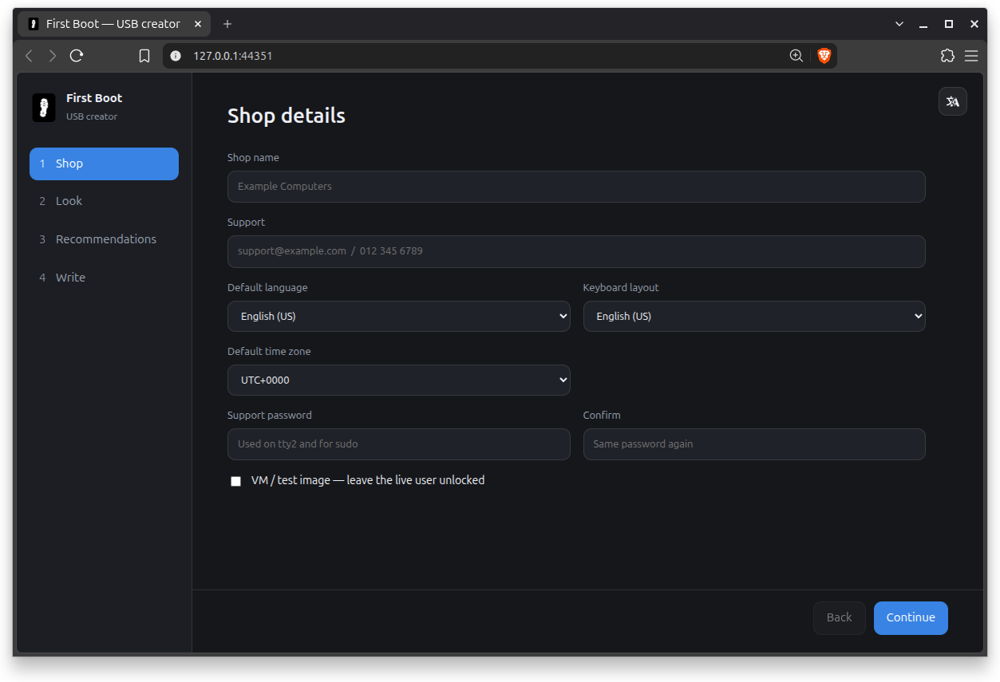
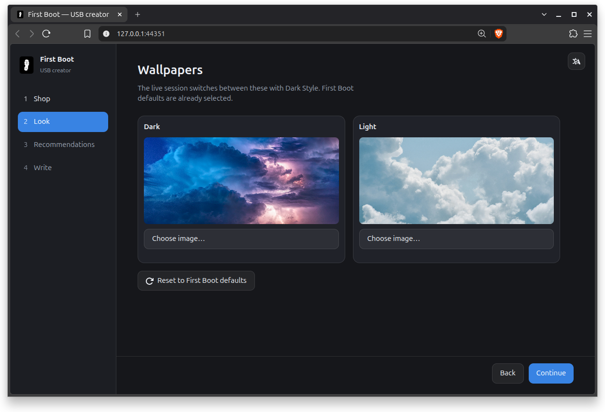
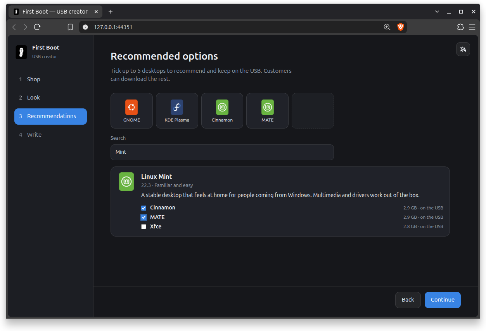
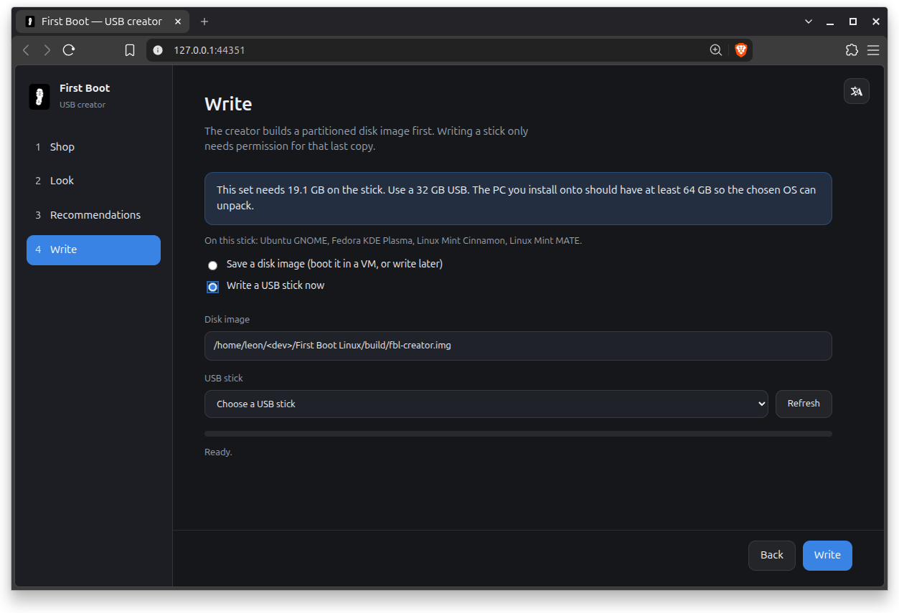

# First Boot Linux

A disposable first-boot appliance for PCs and laptops. Retailers pre-install it. The buyer picks a Linux distribution. First Boot Linux then installs that system and replaces itself.

<i>First Boot Linux desktop environment</i>

## What it is for

It is not meant to be a general-purpose desktop, live USB toolkit, or network boot menu. It is a **pre-installed, first-run distro chooser** aimed at retail and small OEM workflows.
When someone unboxes a machine, they should not be locked into an operating system they never chose. First Boot Linux is a temporary environment whose only job is:

1. Connect to a network (if needed).
2. Show a small set of recommended distros already on disk (configured by the retailer).
3. Offer other distros to download.
4. Install the chosen system and replace this environment.

## Linux desktop needs a pre-install solution

<i>"MS Windows acquired unnatural levels of popularity through pre-installs on new hardware. And I believe this alternative should have existed ~20 years ago.
By all means, a retailer may configure their FBL install to provide Linux distros, BSD or even MS Windows (if possible). It's not for us to tell people what they should want to use. It's for us to provide a choice."</i>

~ Leon de Klerk

  

<i>Video: Linus Torvalds on pre-installs</i>

<i>"The reason the desktop is so hard to crack is most consumers do not want to install an operating system on their machine." ... "The reason Linux is successful on cell phones is not because you have 900,000 people downloading disk images and installing them on their cell phone every day. No, it's because it comes on the cell phone pre-installed. And that has never happened in the desktop market."</i>

~ Linus Torvalds

___

# First Boot USB Creator

The USB Creator provides a method for pre-installing First Boot Linux with its configuration and ISO packages. Simply complete the configuration steps and write to a flash drive. Then install on one or multiple devices.
> [!Note]
> Currently, only an AppImage is available.

# Good practice for recommendations

It is up to the retailer to decide which operating systems they will recommend to their customers.
However, it is good practice to:
- not recommend options you have not tested on the particular device.
- not block or prevent consumers from choosing something different from what you recommend.
- provide basic installation support for your recommendations.
- pick recommended options that your support team is familiar with (If your support team is only familiar with MS Windows, it is perfectly fine to add Windows as the only recommended option).
