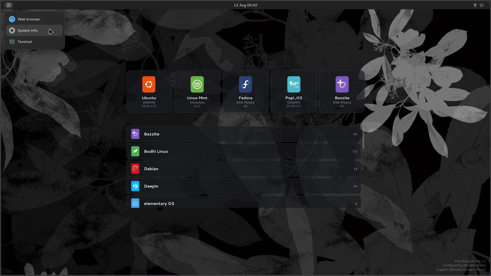
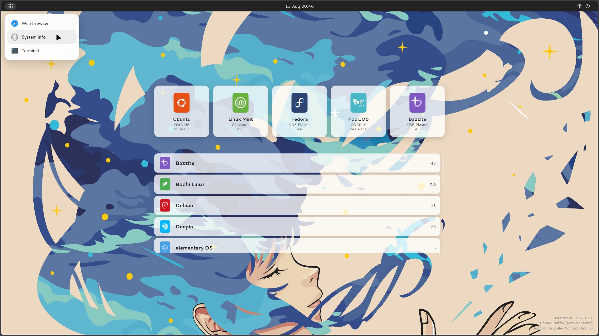

# First Boot Linux

A disposable first-boot appliance for PCs and laptops. Retailers pre-install it. The buyer picks a Linux distribution. First Boot Linux then installs that system and replaces itself.

## What it is for

When someone unboxes a machine, they should not be locked into an operating system they never chose. First Boot Linux is a temporary environment whose only job is:

1. Connect to a network (if needed).
2. Show a small set of recommended distros already on disk (configured by the retailer).
3. Offer other distros to download.
4. Install the chosen system and replace this environment.

- It is not meant to be a general-purpose desktop, live USB toolkit, or network boot menu. It is a **pre-installed, first-run dirsto chooser** aimed at retail and small OEM workflows.
- MS Windows aquired unnatural levels of popularity through pre-intalls on new hardware. This alternative should have existed ~20 years ago.
- By all means, a retailer may configure their iso to provide Linux distros, BSD or even MS Windows (if possible).

<i>"It's not for us to tell people what they should want to use. It's for us to provide a choice."</i>

## Who it is for

| Audience | Why |
|----------|-----|
| **PC / laptop retailers** | Ship hardware with real distro choice without imaging one OS per order. |
| **Independent refurbishers & shops** | Offer a clean Linux path out of the box without forcing any single distro on every customer. |

## Current status

Early design stage.
